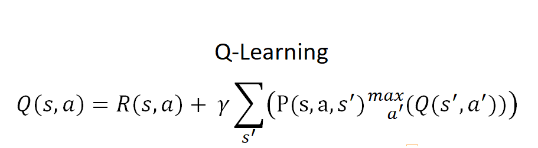
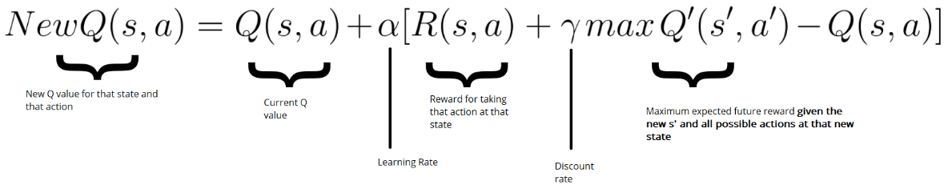
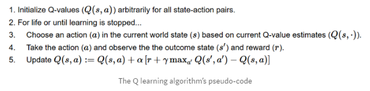
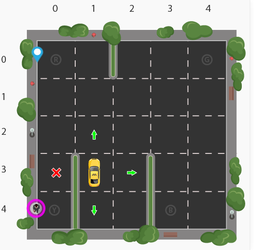
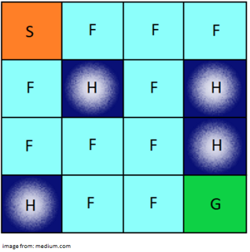

# Reinforcement_Learning

** Q-Learning: **

<figure>
 
 <figcaption>
 

 
 </figcaption>
</figure>

<figure>
 
 <figcaption>
 

 
 </figcaption>
</figure>

Q-Learning Algorithm :

<figure>
 
 <figcaption>
 

 
 </figcaption>
</figure>

Taxi Environment:

<figure>
 
 <figcaption>
 

 
 </figcaption>
</figure>

5x5 grid = 25 Cell
4 locations that we can pick up and drop off a passenger: R, G, Y, B 
The agent encounters one of the 500 states and it takes an action. 5*5*5*4 = 500

Action in our case can be to move in a direction or decide to pickup/dropoff a passenger.
Action Space: South, north, east, west, pickup, dropoff

Positive reward for a successful dropoff (+20)
Negative reward for a wrong dropoff (-10)
Slight negative reward every time-step (-1) 
Each successfull dropoff is the end of an episode

FrozenLake Environment:

<figure>
 
 <figcaption>
 

 
 </figcaption>
</figure>

